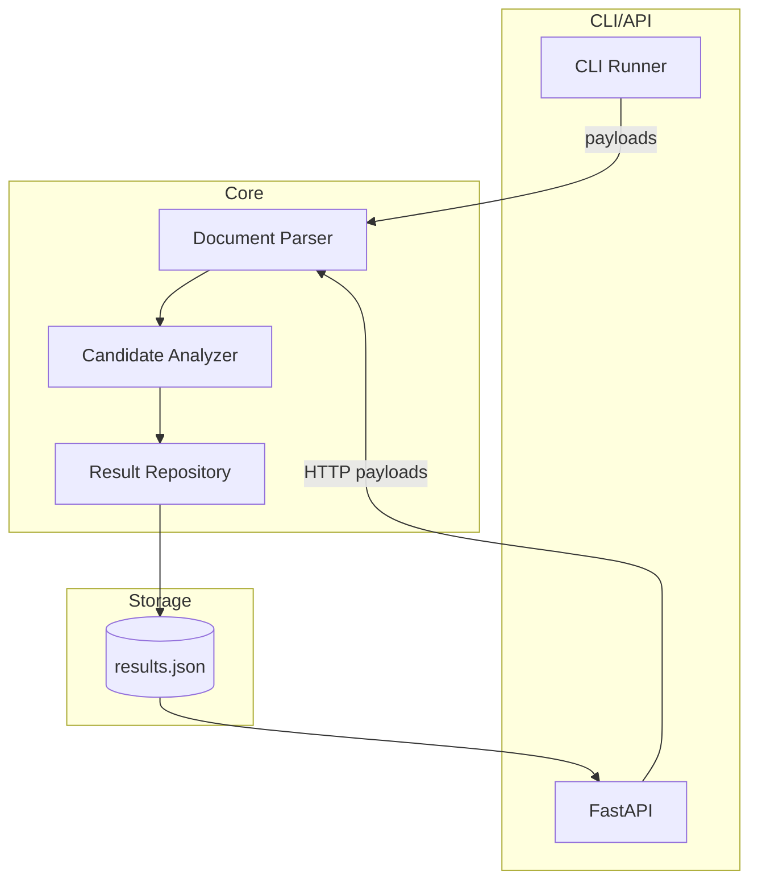

# Kandidate

> Open-source, privacy-first candidate intelligence engine with a full CLI, API, and automation toolchain.


## Intro

Kandidate transforms unstructured resumes and intake forms into structured, explainable insights. The project ships with a modern Python package, FastAPI service, Click-powered CLI, Docker images, CI/CD, and documentation that make it easy to showcase professional engineering workflows.

## Features

- Event-style pipeline that parses files, analyzes content, and stores structured results
- Click CLI (`kandidate run`) and FastAPI REST API with Swagger UI
- Configurable logging, YAML/JSON configuration system, and centralized repository
- Ready-to-use Dockerfile, docker-compose stack, Makefile, and scripts for daily operations
- Pre-commit hooks, pytest + coverage, mypy, flake8, black, and GitHub Actions CI
- Extensible architecture with clear separation between core, services, utils, and models

## Installation

```bash
python -m venv .venv
source .venv/bin/activate
pip install -e .[dev]
pre-commit install
```

## Setup

1. Copy the default config and adjust it as needed:
   ```bash
   cp config/default.yaml config/local.yaml
   # update repository.path, keywords, etc.
   ```
2. Export overrides using environment variables when required:
   ```bash
   export KANDIDATE_LOGGING__LEVEL=DEBUG
   export KANDIDATE_REPOSITORY__PATH=/tmp/results.json
   ```
3. Run the pipeline via CLI or API (see below).

## Usage Examples

### CLI Pipeline

```bash
kandidate run data/samples
kandidate run resume.json --debug
```

### FastAPI Server

```bash
kandidate serve-api --host 0.0.0.0 --port 8080
# visit http://localhost:8080/docs for Swagger UI
```

### Docker

```bash
make docker-build
docker compose up -d
```

## Architecture Diagram



## Roadmap

The full roadmap lives in [`docs/roadmap.md`](docs/roadmap.md). Highlights:

- **Immediate:** polish heuristics, add CLI UX niceties
- **Mid-term:** plug in external vector search + background workers
- **Long-term:** integrate collaboration workflows and frontend dashboard

## Author & License

Architected by Badiea Al-Shabili and the open-source community. Released under the [MIT License](LICENSE).
