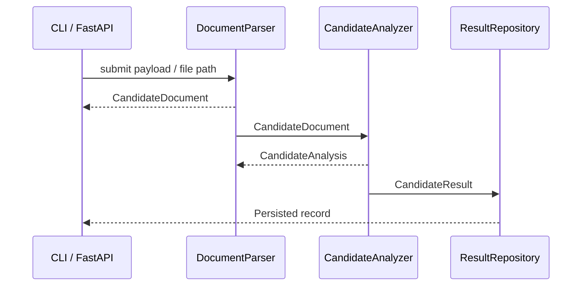

# Architecture

Kandidate embraces a modular layout organized by responsibility:

```
kandidate/
  core/        # Pipeline orchestration
  models/      # Pydantic models and config dataclasses
  services/    # Parser, Analyzer, FastAPI API, Repository
  utils/       # Logging and config loading helpers
```

## Flow Diagram



## Module Responsibilities

- **core.pipeline.Pipeline** orchestrates the ingest-analyze-store lifecycle and wires together the underlying services.
- **services.parser.DocumentParser** normalizes filesystem inputs and API payloads into `CandidateDocument` models.
- **services.analyzer.CandidateAnalyzer** executes deterministic heuristics (keyword coverage, length checks, warnings) and produces `CandidateAnalysis`.
- **services.repository.ResultRepository** persists results using JSON for transparency; backends can be swapped by extending this service.
- **services.api** exposes HTTP endpoints (`/health`, `/candidates`) through FastAPI and shares the same pipeline configuration as the CLI.
- **utils.config_loader** merges YAML/JSON files, environment variables, and runtime overrides to produce strongly typed dataclasses.
- **utils.logging** centralizes logging so CLI/API/tests inherit consistent formatting and log levels.

## Deployment Options

- **Local development:** `make dev` launches the FastAPI server with live reload.
- **Containers:** Dockerfile packages the entire runtime; docker-compose adds port mappings and volume mounts.
- **CI:** GitHub Actions workflow runs formatting, linting, type checks, and pytest with coverage to ensure quality gates never regress.
